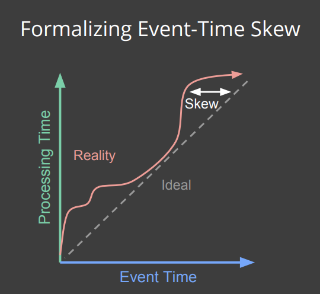

# 3. Processing Time und Event Time

Processing Time ist die Zeit wo die Daten verarbeitet werden und Event Time gibt die Zeit an, wann der Datensatz wirklich entstanden ist. Beispielsweise wird von einem Smartphone aus ein Fehler geloggt, aber die übermittlung des Fehlers passiert erst dann wenn das mobile Gerät zum Beispiel wieder im WLAN ist und erst dann vom Server empfangen werden kann. Die Event Time ist somit die Auslösung des Fehlers und die Processing Time ist die Verarbeitungszeit des Fehlers auf dem Server.

Stellt man beide Zeiteinheiten in Proportion zueinander da, bildet sich eine Ideallinie die linear verläuft.

Würden Daten direkt beim Auftreten verarbeitet werden, würde die Punkte im Diagramm auf der Ideallinie verlaufen. In der realität von verteilten Systemen sieht es etwas anders aus. Dies symbolisiert die rote Linie. Die Verzögerung ist über den Zeitverlauf gesehen sehr variable und kann sich somit der Ideallinie nähern oder weiter links davon distanzieren. Alternativ wird die rote Linie auch Watermark bezeichnet. Um zu ermitteln, bis zu welcher Zeit Events bereits verarbeitet wurden, gibt es Watermarks. Diese zeigen – wie bei einem Wasserstand –  den bislang erreichten “Zeitpegel” an. Beim Erreichen eines Watermarks wird das Ergebnis der Berechnung dann materialisiert. Wenn beispielsweise der Watermark als der Zeitpunkt des neusten Events abzüglich eines fixen Puffers von 30 Sekunden definiert ist, bedeutet dies “Es wird angenommen, dass nun alle Events bis zum Zeitpunkt x angekommen sind. x ist in diesem Fall der Watermark definiert als Zeitpunkt(neuestes Event) – 30 Sekunden”

Zudem gibt es noch heuristische Watermarks, bei denen der Puffer – zum Beispiel basierend auf empirischen Messungen – dynamisch angepasst wird. So könnte das System beobachten, dass Events nachts immer mit deutlicher Verzögerung empfangen werden. Der Puffer könnte auf dieser Grundlage erhöht werden. Ebenso könnte aus der Verzögerung der letzten Stunde die erwartete Verzögerung extrapoliert werden. Außerdem gibt es noch den – zumeist unrealistischen – perfekten Watermark, bei dem die Verarbeitung des Event direkt beim Auftreten des Events stattfindet.

Um in dieser Umgebung herauszufiltern welches die beste Strategie ist um seine Daten um Datenstrom zu analysieren gibt es 4 Leitfragen (Beam Model) im Apache Beam umfeld.

------------
[vorheriges Kapitel](2_Datastreams.md) | [nächstes Kapitel](4_What_Where_When_How.md)
